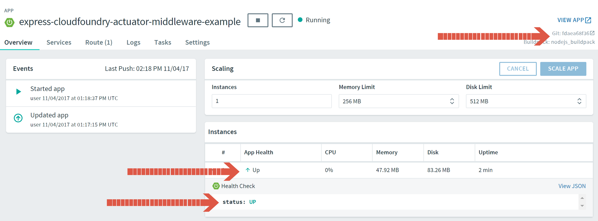
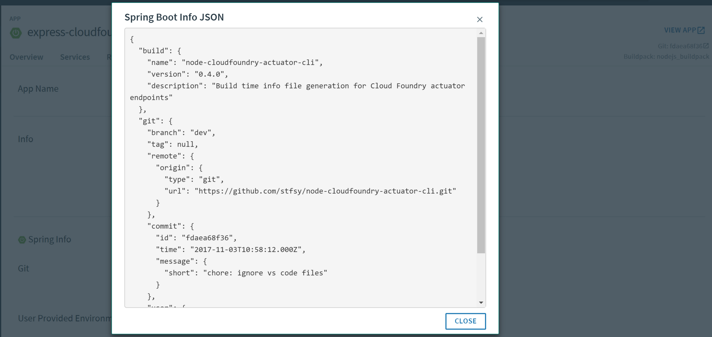

# node-cloudfoundry-actuator

[](https://travis-ci.org/stfsy/node-cloudfoundry-actuator)
[](https://github.com/stfsy/node-cloudfoundry-actuator/blob/master/package.json)
[](https://github.com/stfsy/node-cloudfoundry-actuator/blob/master/package.json)
[](https://www.npmjs.com/package/node-cloudfoundry-actuator)
[](https://www.npmjs.com/package/node-cloudfoundry-actuator)
[](https://github.com/stfsy/node-cloudfoundry-actuator/releases)
[](https://github.com/stfsy/node-cloudfoundry-actuator/issues)
[](https://github.com/stfsy/node-cloudfoundry-actuator/blob/master/LICENSE)


Actuator support for NodeJS Cloud Foundry Applications.

Currently provides **health** and **info** endpoints for Cloud Foundry Apps Manager. These two and future Endpoints are restricted to users that 
- are currently logged into the Apps Manager and 
- have sufficient privileges to view sensitive information.

Use [Cloud Foundry Actuator CLI](https://github.com/stfsy/node-cloudfoundry-actuator-cli) to generate a build **info** file ahead of deployment time. This file is optional, but we can't show version infos without it. 

**Health** status will be shown automatically and will be costumizable in the future.

See [Express Cloud Foundry Actuator Middleware Example](https://github.com/stfsy/express-cloudfoundry-actuator-middleware-example) for an example application with full integration of [Cloud Foundry Actuator CLI](https://github.com/stfsy/node-cloudfoundry-actuator-cli) and [Express Cloud Foundry Actuator Middleware](https://github.com/stfsy/node-cloudfoundry-actuator).

## Installation

```
npm install node-cloudfoundry-actuator --save
```

## Example
The **Cloud Foundry Apps Manager** needs to be able to call various actuator endpoints to fetch health state and build informations. Applications integrating this library need to expose these **endpoints**.

A typical **Connect** middleware implementation might look like this:
```js
'use strict'

const Actuator = require('node-cloudfoundry-actuator')
const actuator = new Actuator()

module.exports = (options) => {
    return (req, res, next) => {
        let handled = false
        
        try {
            handled = actuator.handle(req, res)
        } catch (e) {
            // handle errors gracefully
        }

        if (!handled) {
            next()
        }
    }
}
```

The **main** class of this library has one public method **handle** which accepts a **HttpRequest** and **HttpResponse**. Instances of this class will handle positive responses and expect the implementing library to handle errors.

Only requests to a path matching **/cloudfoundryapplication[/\*]** will be intercepted and answered.

## Screenshots

### App overview


### Settings with app short info

### Settings with app info popup


## License

This project is distributed under the MIT license.